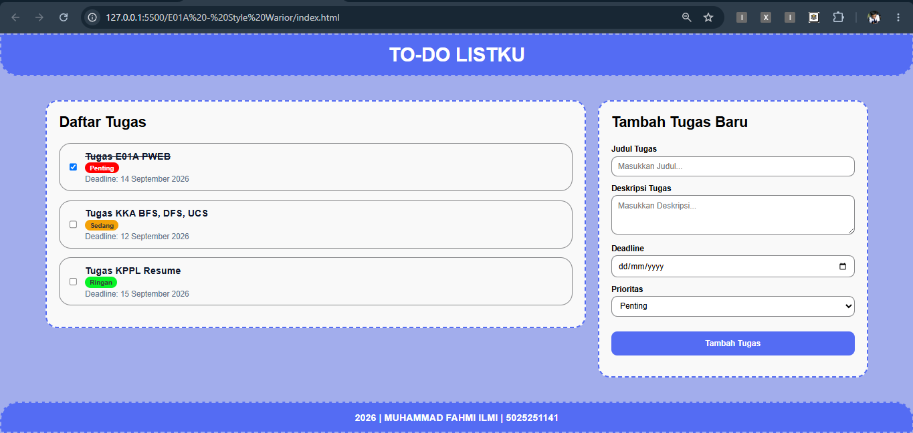
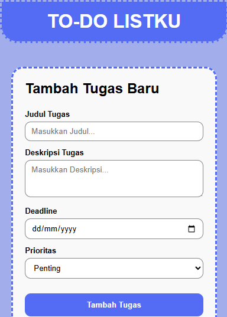
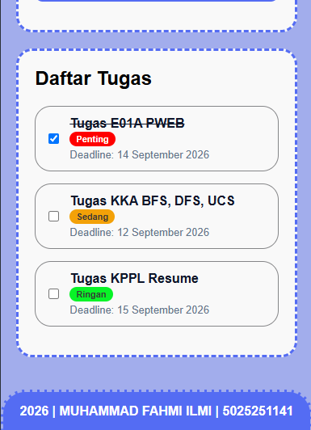
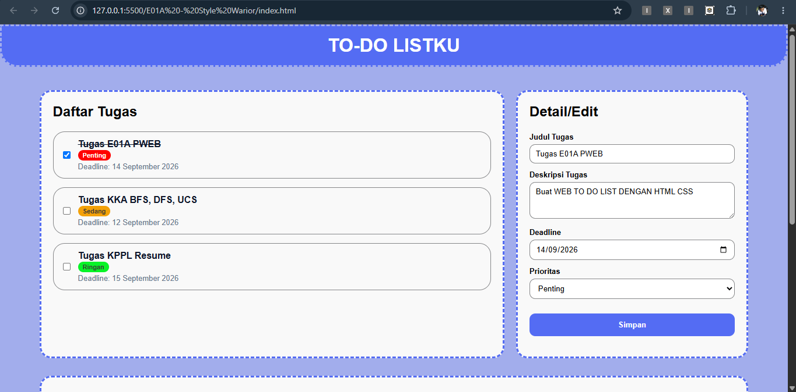
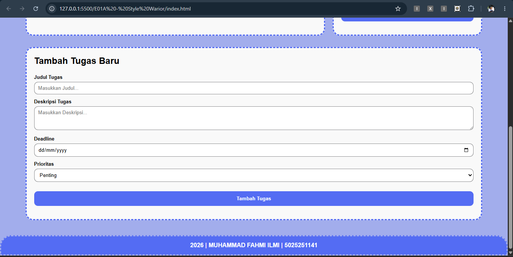
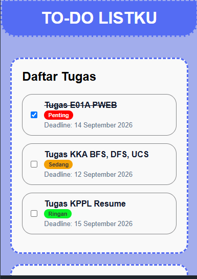
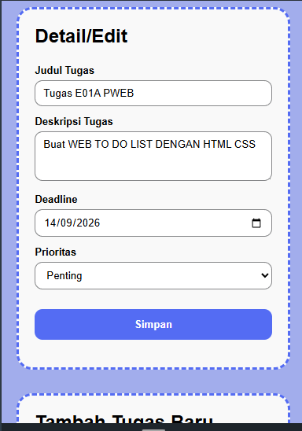
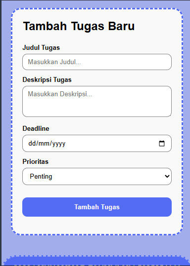

# [E01a] The Style Warrior - Todo List App

Tugas membuat tampilan **Todo List** menggunakan HTML dan CSS sesuai dengan kriteria.

| Nama                | NRP        |  Kelas     |
| ------------------- | ---------- | ---------- |
| Muhammad Fahmi Ilmi | 5025251141 | PWEB A     |

## Deskripsi

### 1. Semantic HTML Elements

Menggunakan beberapa elemen semantic HTML5 seperti `<header>`, `<main>`, `<aside>`, dan `<footer>` untuk membagi struktur halaman.

1. `<header>` saya gunakan sebagai tempat judul utama `<h1>`  
    kutipan kode:

   ```html
   <header>
     <h1>TO-DO LISTKU</h1>
   </header>
   ```

2. `<main>` saya gunakan sebagai tempat untuk panel kiri  
    kutipan kode:
   ```html
   <main class="panel-kiri">
     <section class="list">
       <h2>Daftar Tugas</h2>
       <ul class="todo-list">
         <li class="todo-item">
           <input type="checkbox" checked />
           <div class="todo-info">
             <h3 class="done">Tugas E01A PWEB</h3>
             <span class="badge high">Penting</span>
             <p>Deadline: 14 September 2026</p>
           </div>
         </li>
         <li class="todo-item">
           <input type="checkbox" />
           <div class="todo-info">
             <h3>Tugas KKA BFS, DFS, UCS</h3>
             <span class="badge medium">Sedang</span>
             <p>Deadline: 12 September 2026</p>
           </div>
         </li>
         <li class="todo-item">
           <input type="checkbox" />
           <div class="todo-info">
             <h3>Tugas KPPL Resume</h3>
             <span class="badge low">Ringan</span>
             <p>Deadline: 15 September 2026</p>
           </div>
         </li>
       </ul>
     </section>
   </main>
   ```
3. `<aside>` saya gunakan sebagai tempat untuk panel kanan  
    kutipan kode:
   ```html
   <aside class="panel-kanan">
     <section class="form">
       <h2>Tambah Tugas Baru</h2>
       <form class="todo-form">
         <label for="judul">Judul Tugas</label><br />
         <input
           type="text"
           id="judul"
           placeholder="Masukkan Judul..."
           required
         />
         <br />
         <label for="desc">Deskripsi Tugas</label><br />
         <textarea
           id="desc"
           placeholder="Masukkan Deskripsi..."
           rows="3"
         ></textarea>
         <br />
         <label for="deadline">Deadline</label><br />
         <input type="date" id="deadline" required />
         <br />
         <label>Prioritas</label><br />
         <select required>
           <option selected value="high">Penting</option>
           <option value="medium">Sedang</option>
           <option value="low">Ringan</option>
         </select>
         <button type="submit" title="Tambah Tugas">Tambah Tugas</button>
       </form>
     </section>
   </aside>
   ```
4. `<footer>` saya gunakan sebagai tempat identitas, seperti nama nrp
   kutipan kode:
   ```html
   <footer>
     <p>2026 | MUHAMMAD FAHMI ILMI | 5025251141</p>
   </footer>
   ```

### 2. Layout 2 Panel

Layout utama menggunakan **Flexbox** dan dibagi menjadi dua panel:

- **Panel kiri** untuk menampilkan daftar tugas.  
   kutipan kode:
  ```html
  <main class="panel-kiri">
    <section class="list">
      <h2>Daftar Tugas</h2>
      <ul class="todo-list">
        <li class="todo-item">
          <input type="checkbox" checked />
          <div class="todo-info">
            <h3 class="done">Tugas E01A PWEB</h3>
            <span class="badge high">Penting</span>
            <p>Deadline: 14 September 2026</p>
          </div>
        </li>
        <li class="todo-item">
          <input type="checkbox" />
          <div class="todo-info">
            <h3>Tugas KKA BFS, DFS, UCS</h3>
            <span class="badge medium">Sedang</span>
            <p>Deadline: 12 September 2026</p>
          </div>
        </li>
        <li class="todo-item">
          <input type="checkbox" />
          <div class="todo-info">
            <h3>Tugas KPPL Resume</h3>
            <span class="badge low">Ringan</span>
            <p>Deadline: 15 September 2026</p>
          </div>
        </li>
      </ul>
    </section>
  </main>
  ```
- **Panel kanan** untuk form tambah atau edit tugas.  
   kutipan kode:

  ```html
  <aside class="panel-kanan">
    <section class="form">
      <h2>Tambah Tugas Baru</h2>
      <form class="todo-form">
        <label for="judul">Judul Tugas</label><br />
        <input
          type="text"
          id="judul"
          placeholder="Masukkan Judul..."
          required
        />
        <br />
        <label for="desc">Deskripsi Tugas</label><br />
        <textarea
          id="desc"
          placeholder="Masukkan Deskripsi..."
          rows="3"
        ></textarea>
        <br />
        <label for="deadline">Deadline</label><br />
        <input type="date" id="deadline" required />
        <br />
        <label>Prioritas</label><br />
        <select required>
          <option selected value="high">Penting</option>
          <option value="medium">Sedang</option>
          <option value="low">Ringan</option>
        </select>
        <button type="submit" title="Tambah Tugas">Tambah Tugas</button>
      </form>
    </section>
  </aside>
  ```

  Menggunakan Flexbox supaya tampilan panel bisa kanan kiri.  
   kutipan kode:

  ```css
  .container {
    display: flex;
    gap: 20px;
    max-width: 90%;
    margin: 0 auto;
    padding: 15px;
  }

  .panel-kiri {
    flex: 2;
  }

  .panel-kanan {
    flex: 1;
  }
  ```

  - Panel kiri mengambil ukuran 2 kali ukuran panel kanan. Sehingga panel kiri yang berisi list tugas terlihat lebih lebar.

### 3. Form Input

Panel kanan berisi form untuk memasukkan data tugas, seperti:

- Judul tugas
  ```html
  <label for="judul">Judul Tugas</label><br />
  <input type="text" id="judul" placeholder="Masukkan Judul..." required />
  ```
- Deskripsi
  ```html
  <label for="desc">Deskripsi Tugas</label><br />
  <textarea id="desc" placeholder="Masukkan Deskripsi..." rows="3"></textarea>
  ```
- Deadline
  ```html
  <label for="deadline">Deadline</label><br />
  <input type="date" id="deadline" required />
  ```
- Prioritas tugas
  ```html
  <label>Prioritas</label><br />
  <select required>
    <option selected value="high">Penting</option>
    <option value="medium">Sedang</option>
    <option value="low">Ringan</option>
  </select>
  ```

### 4. Data Statis

Daftar tugas menggunakan data dummy/statis. Setiap tugas memiliki checkbox, judul, deadline, dan tingkat prioritas.

```html
<li class="todo-item">
  <input type="checkbox" checked />
  <div class="todo-info">
    <h3 class="done">Tugas E01A PWEB</h3>
    <span class="badge high">Penting</span>
    <p>Deadline: 14 September 2026</p>
  </div>
</li>
```

### 5. Responsive Design Tampilan dibuat responsive menggunakan `@media
(max-width: 768px)`. Pada layar yang lebih kecil, kedua panel akan berubah
menjadi satu kolom dan form akan berada di bagian atas. 
```css
@media (max-width: 768px) {
    .container {
        flex-direction: column;
    }

    .panel-kanan{
        order: -1;
    }

    .panel-kiri {
        order: 1;
    }
}
```
- Saat di buka di mobile tampilan panel akan menjadi atas bawah. kemudian panel kanan di tampilkan di atas panel kiri dengan mengubah urutannya menggunakan properti `order`.

### 6. External CSS
Style halaman dipisahkan ke dalam file `style.css`, sehingga file HTML hanya
berisi struktur halaman dan file CSS digunakan untuk mengatur tampilan. 
```html
<link rel="stylesheet" href="style.css">
```

## Preview 
- Tampilan Desktop  


- Tapilan Mobile  
  


## VERSI 2 - JIKA ADA DETAIL/EDITOR  
- Tampilan Desktop  



- Tapilan Mobile  
  



TERIMA KASIH 
